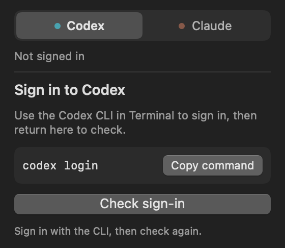
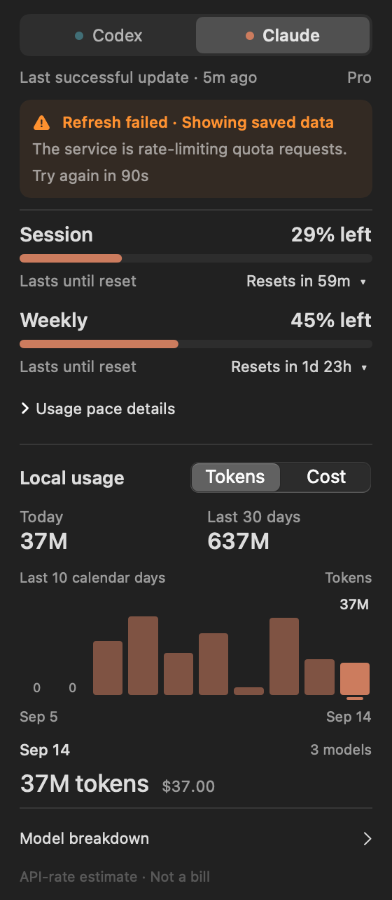
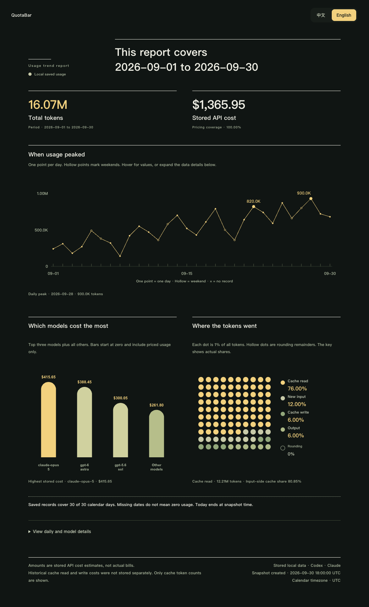
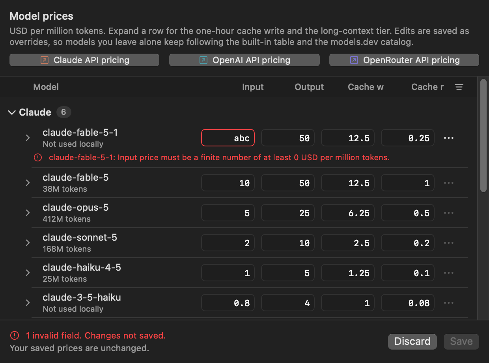

<p align="center">
  
</p>

<h1 align="center">QuotaBar</h1>

<p align="center">
  <a href="README.md"><kbd>English</kbd></a>
  <a href="README.zh-CN.md"><kbd>简体中文</kbd></a>
</p>

A macOS menu bar app for checking Codex and Claude quota, reset times, local token usage, and estimated cost.

[Install](#install) · [First launch](#first-launch) · [Quota](#how-quota-tracking-works) · [Cost](#how-cost-tracking-works) · [Reports](#exporting-a-usage-report) · [Pricing](#editing-model-prices) · [Development](#build-and-develop) · [Troubleshooting](#troubleshooting)

<p align="center">
  
</p>

Screenshots and animations use sample data. The app interface is in English; exported reports support Chinese and English. View the card in [dark](docs/images/interactions/main-dark.png) or [light](docs/images/interactions/main-light.png) appearance.

## Features

- Track session and weekly quota, reset times, usage pace, and available credits. Failed refreshes keep the last good reading.
- View local tokens and estimated cost by day and model, including matching OpenCode and Pi Agent OAuth usage under Codex.
- Estimate Standard, Fast, and long-context costs, including GPT-6 Astra. Edit Standard rates in Settings.
- Export 7 or 30 days of saved usage as an offline HTML report with Chinese and English views.

## Install

Requires **macOS 14+**. Prebuilt releases and the Homebrew cask support **Apple Silicon** and do not require Xcode or Swift.

Quota tracking uses OAuth credentials created by Codex CLI, Claude Code, or both on the same Mac. API-key-only sessions are not supported.

### Homebrew

```bash
brew install --cask softmaxe/tap/quota-bar
```

<details>
<summary>Update or uninstall</summary>

```bash
brew upgrade --cask quota-bar
brew uninstall --cask quota-bar
```

To remove the app and its saved data:

```bash
brew uninstall --zap --cask quota-bar
```

</details>

<details>
<summary>Manual download and first-launch security prompt</summary>

Download the `arm64` ZIP from [GitHub Releases](https://github.com/softmaxe/quota-bar/releases), unzip it, and move `QuotaBar.app` to `/Applications`.

Each ZIP has a matching `.sha256` file. Verify it before unzipping:

```bash
shasum -a 256 -c QuotaBar-*-macos-arm64.zip.sha256
```

Releases are ad hoc signed, not notarized with an Apple Developer ID. If macOS blocks the first launch, try opening the app once, then go to **System Settings → Privacy & Security** and choose **Open Anyway**. As a fallback, after confirming the app is in `/Applications`, remove quarantine from this app only:

```bash
xattr -dr com.apple.quarantine /Applications/QuotaBar.app
```

</details>

## First launch

QuotaBar reuses OAuth credentials created by the official CLIs. It has no separate login flow. Sign in through each CLI you want to track:

```bash
codex login
claude
```

Open QuotaBar, click its menu bar icon, and select **Codex** or **Claude**. Open [Settings](docs/images/settings-general.png) to choose a refresh interval or [edit model prices](#editing-model-prices).

If a provider is not signed in, choose **Copy command**, run the copied command in Terminal, then return and choose **Check sign-in**. Copying the command does not run it.

Reading Claude credentials may trigger a macOS Keychain prompt. If a manual **Refresh** receives HTTP 401, QuotaBar lets Claude Code attempt one short credential refresh. Automatic refreshes never start Claude Code.

## How quota tracking works

### Quota windows and usage pace

Each limited quota window shows the percentage left and its reset time. Choose **Countdown** or **Clock time** in the reset-time control to update both limited windows. Unlimited sessions show **Session ∞** and **No limit**. Expand **Usage pace details** for reserve, deficit, and headroom.

QuotaBar compares consumption with time elapsed. After at least three comparable recorded weekly windows, history also informs the weekly pace. Samples are kept for 56 days.

After QuotaBar detects a session or weekly reset, the next open plays a brief bar animation while the headline shows the new reading. The app respects macOS Reduce Motion.

<details>
<summary>Quota reset animation</summary>

<p align="center">
  
</p>

</details>

### Refresh and recovery

Choose manual refresh or an interval of 1, 2, 5, 15, or 30 minutes in Settings. The default is 5 minutes.

- Polling, opening the card, and clicking **Refresh** update only the selected provider. Switching tabs requests an update for the newly selected provider.
- Each provider has a one-minute refresh cooldown. A server rate limit can extend the wait.
- An explicit Claude credential-recovery action can bypass the local cooldown, but still respects the server limit.

A failed refresh keeps the last good quota and shows its age and recovery instructions at the top. The retry control shows the remaining wait when a cooldown applies. Local scanning has its own progress and **Retry local scan** action.

<details>
<summary>Sign-in and refresh-failure examples</summary>

<table align="center">
  <tr><th>Sign-in guidance</th><th>Refresh failure with saved quota</th></tr>
  <tr>
    <td valign="top"></td>
    <td valign="top"></td>
  </tr>
</table>

</details>

### Menu bar and shortcuts

The menu bar robot reflects the selected provider's quota and refresh status. It turns red when either the session or weekly window has 10% or less left. It dims after a failed refresh and fades further when no data is available.

<p align="center">
  
</p>

The icon is Material Design Icons' `robot-excited`. The card scrolls when needed, keeps its bottom actions visible, and reopens with details collapsed. Shortcuts apply while the card is open:

| Shortcut | Action |
| --- | --- |
| ⌘1 / ⌘2 | Show Codex / Claude |
| ⌘R | Refresh or check sign-in, when available |
| ⌘, | Open settings |
| ⌘Q | Quit, with a prompt for unsaved price edits |
| Esc | Close the card |

<details>
<summary>Mouse, tab, and motion behavior</summary>

Provider tabs have equal widths and fixed label positions. The selected tab has a highlighted background and bold name; hover adds a lighter highlight. Left clicks toggle the card on mouse-down, right clicks on mouse-up. Buttons respond on press, and expanded rows appear together. Reduce Motion removes custom transitions while keeping pressed and selected states visible.

</details>

## How cost tracking works

QuotaBar calculates token and cost totals from local session data. It does not use a billing API.

### Reading the chart

Choose **Tokens** or **Cost** above the chart. The chart covers ten calendar days; totals cover the last 30 days. Hover to preview a day, click to pin it, or use Left and Right Arrow when a date is focused. **Model breakdown** lists that day's models and keeps the date fixed. Reopen the card to resume hover previews. Switching units preserves the selected date.

Missing information has a separate display from zero usage:

| Display | Meaning |
| --- | --- |
| **0** or **$0.00** | The scanned value is zero at the displayed precision. Missing prices have a separate status. |
| **—**, **Not scanned yet** | The date is later than the last completed scan and has no recorded usage yet. |
| **—**, **Unpriced** | Usage is recorded, but no cost can be estimated from its model rates. |
| **Partial estimate** | The amount includes priced usage only; unpriced usage is excluded. |

Add missing rates for future usage in **Settings → Pricing**.

<details>
<summary>Chart date previews</summary>

<p align="center">
  
</p>

</details>

### Data sources

| Source | Local data |
| --- | --- |
| Codex | `$CODEX_HOME/sessions` and `$CODEX_HOME/archived_sessions`, or the same paths under `~/.codex` |
| Claude | `$CLAUDE_CONFIG_DIR/projects`, or `~/.claude/projects` and `~/.config/claude/projects` |
| OpenCode | `$OPENCODE_DATA_HOME/opencode.db`, `$XDG_DATA_HOME/opencode/opencode.db`, or `~/.local/share/opencode/opencode.db` |
| Pi Agent | `$PI_CODING_AGENT_SESSION_DIR`, `$PI_CODING_AGENT_DIR/sessions`, or `~/.pi/agent/sessions` |

OpenCode `openai` usage and Pi Agent `openai-codex` assistant usage count toward Codex totals only when they use OAuth with the current Codex account. Other providers, API-key sessions, and account mismatches are excluded. These local totals do not affect quota bars.

### Saved history

The first scan of a large history may take time. QuotaBar saves dates, models, sources, tokens, and estimated costs in SQLite, with identifiers and scan positions for deduplication. Saved usage survives source-session deletion and app restarts, including records outside the chart and totals windows. Sessions deleted before scanning cannot be recovered.

<details>
<summary>Incremental scanning and database migration</summary>

Codex and Claude resume from the last byte read. OpenCode and Pi Agent deduplicate records by stable IDs. Standard Codex rollout UUIDs prevent archive moves and copies from counting twice. Codex also caches the active model, service tier, and last token totals, so appending to a long session does not replay earlier records.

On first use, QuotaBar copies any existing cost database from `~/Library/Caches/QuotaBar/cost-usage/` to the [persistent location](#privacy-and-network-access), including committed SQLite WAL data. The old cache remains intact. Scanner upgrades preserve recorded history instead of rebuilding it from source logs.

</details>

### Pricing rules

- Standard rates use manual overrides first, then the [models.dev](https://models.dev) catalog, then the [built-in pricing table](Sources/QuotaBarCore/Cost/CostPricing.swift).
- Astra falls back to its complete built-in row when a catalog entry omits cache or long-context rates.
- Codex Fast usage uses a separate built-in table and ignores manual overrides and catalog rates. A Fast model without an entry stays unpriced.

The pricing catalog is cached for 24 hours. Manual rate changes apply to newly recorded usage. Past totals keep the prices used when they were scanned.

Cost totals are estimates. Provider billing rules, cache accounting, and price changes can make them differ from an invoice.

## Exporting a usage report

1. Open **Settings → Export**, or press ⌘3 while the settings window is active.
2. Choose **Last 7 days** or **Last 30 days**.
3. Leave **Open after export** selected to open the result immediately.
4. Choose **Export Report…** and select a destination. If the period has no saved usage, QuotaBar reports that before opening the Save panel.

<p align="center">
  
</p>

The report is a single offline HTML file with a Chinese/English switch. It includes all eligible Codex, Claude, OpenCode, and Pi Agent usage already saved in SQLite, with daily usage, cost by model, token and cache composition, and expandable data tables.

Export reads saved data without refreshing quota, rescanning logs, updating prices, or making network requests. Costs retain their saved estimates; unpriced tokens are excluded from costs and pricing gaps are marked. Cache tokens are shown without inferring a separate cache cost.

The file includes the period, capture time, timezone, sources, models, token counts, unpriced-token counts, and saved costs. It excludes prompts, responses, reasoning text, credentials, and account IDs. See [Usage report export](docs/usage-report-export.md) for the data contract and developer checks.

## Editing model prices

Open **Settings → Pricing**. Rates are in USD per million tokens. Expand a model row to edit its one-hour cache write rate, long-context threshold, and rates above that threshold.

The table lists supported API models and unpriced models found locally. Click a column heading to sort; reset the order to restore the API model list and sort **Others** by usage.

<p align="center">
  
</p>

- Rates must be finite and nonnegative; an optional long-context threshold must be a positive whole token count. Invalid fields disable **Save**.
- **Save** shows progress and its result. Drafts survive failed saves, tab switches, and closing Settings while the app is running. **Discard** restores the last saved rates.
- To remove an override, choose **Restore default rate** or **Clear custom rate** in the model's **…** menu, then save.
- Quitting with a valid draft offers **Save**, **Discard**, or **Cancel**. Invalid drafts must be corrected before saving.

<details>
<summary>Invalid price example</summary>

<p align="center">
  
</p>

</details>

Saved rates apply to newly recorded usage. Existing history keeps the prices used when it was scanned, including previously unpriced usage.

## Privacy and network access

QuotaBar reads CLI credentials and parses local session records, but it does not write to CLI credential stores itself. A manual Claude credential recovery can launch Claude Code, which may update its own credentials. QuotaBar uses timestamps, model names, token counts, stable record IDs, and the account IDs needed to match OAuth sessions. Prompt, response, and reasoning text are not stored in QuotaBar's usage history or uploaded.

<details>
<summary>Local storage paths</summary>

```text
~/Library/Application Support/QuotaBar/usage-history.json
~/Library/Application Support/QuotaBar/pricing-overrides.json
~/Library/Application Support/QuotaBar/cost-usage/cost-usage.sqlite
~/Library/Caches/QuotaBar/model-pricing/
~/Library/Preferences/com.quotabar.app.plist
```

</details>

Codex quota requests use the `chatgpt_base_url` in `$CODEX_HOME/config.toml`, if set, or the default ChatGPT endpoint. QuotaBar also contacts `auth.openai.com` to refresh Codex tokens, `api.anthropic.com` for Claude quota, and `models.dev` for model pricing. It does not send local session records to these services.

## Build and develop

Building requires the Swift 6 toolchain from Xcode or the Command Line Tools. The project uses Swift Package Manager and has no Xcode project.

```bash
git clone https://github.com/softmaxe/quota-bar.git
cd quota-bar
make app
open build/QuotaBar.app
```

<details>
<summary>If Command Line Tools reports a missing SwiftUIMacros plugin</summary>

Use the installed Xcode toolchain for that command:

```bash
DEVELOPER_DIR=/Applications/Xcode.app/Contents/Developer \
PATH=/Applications/Xcode.app/Contents/Developer/Toolchains/XcodeDefault.xctoolchain/usr/bin:$PATH \
make app
```

</details>

<details>
<summary>Development commands</summary>

| Command | Purpose |
| --- | --- |
| `make build` | Build the debug binary. |
| `make run` | Build and run in the foreground. |
| `make test` | Run core assertions and UI/policy verifiers. |
| `make probe` | Check both provider integrations. |
| `make probe-cost` | Rescan local logs; may refresh model prices. |
| `make benchmark-startup` | Measure status-item construction offline in a debug build. |
| `make benchmark-cost` | Benchmark Codex scans with offline pricing; reads local logs. |
| `make benchmark-cost PROVIDER=claude` | Benchmark Claude with the same offline pricing. |
| `make logs` | Stream logs for `com.quotabar.app`. |
| `make readme-assets` | Rebuild screenshots, state examples, and GIFs. |
| `make clean` | Remove build output. |

`make probe` prints account and usage metadata. Review its output before sharing it.

</details>

<details>
<summary>UI previews and screenshots</summary>

To preview interactions with sample quota and cost data, run:

```bash
make build
.build/debug/QuotaBar --preview-interface loaded
```

Use `signed-out` or `stale` instead of `loaded` to inspect those states. Preview uses isolated preferences and temporary history, with no credential access, provider requests, or real log scans. Choose **Quit** in the preview to clear its temporary data. It can run alongside the installed app, so an additional menu bar icon is expected.

`make readme-assets` renders both READMEs' shared images from the current views with sample data, including the sign-in, refresh-failure, and invalid-price states. Regenerate them after changing the UI.

Asset generation requires ffmpeg. The HTML report image also needs Node.js, Playwright, and a Chromium browser; see [report development checks](docs/usage-report-export.md#verification). The [implementation notes](docs/design-implementation.md) describe the rendering commands and verification limits.

</details>

<details>
<summary>Packaging and releases</summary>

To create a test package, run **Build and Release** from the repository's **Actions** tab and select the branch to build. Manual runs upload a development ZIP and SHA-256 file as workflow artifacts without publishing a release.

To publish a release, push a tag matching `vMAJOR.MINOR.PATCH`. The tag supplies the app's version. The workflow tests and packages an `arm64` ZIP, verifies its signature, version, architecture, and checksum, publishes the GitHub Release, and then updates `softmaxe/homebrew-tap`. Tagged runs require the repository's `TAP_GITHUB_TOKEN` secret. Check both **Release** and **Update Homebrew tap** before treating the release process as complete.

</details>

## Troubleshooting

| Problem | What to check |
| --- | --- |
| Provider is not signed in | Copy the command in the card, complete the CLI login, then choose **Check sign-in**. Use `make probe` for the raw error. |
| Data is stale or refresh returns HTTP 429 | Read the warning above the saved quota. Wait for the retry countdown, then retry; a server limit may last longer than one minute. |
| Local scan failed | Read the local usage error and choose **Retry local scan**. Confirm the CLI writes session logs to the paths above. |
| Cost shows Unpriced or Partial estimate | Add missing model rates in **Settings → Pricing** for newly recorded usage. Existing history keeps its original pricing. |
| A date shows Not scanned yet | Wait for the local scan to finish. This means the date is not covered yet, rather than zero usage. |
| Price changes cannot be saved | Correct the marked fields. If saving failed, the draft remains available to retry or discard. |
| OpenCode usage is missing | Confirm OpenCode uses `openai` OAuth with the same account as Codex. Check **Settings → Pricing** for database or authentication errors. |
| Pi Agent usage is missing | Confirm Pi Agent uses `/login openai-codex` with the same account as Codex. Check **Settings → Pricing** for session or authentication errors. |

## Limitations

- Prebuilt releases and the Homebrew cask support Apple Silicon only. Release ZIPs are ad hoc signed and not notarized.
- Claude credential recovery runs only after a manual **Refresh** and may still require opening Claude Code for interactive sign-in.
- Cost figures come from local logs and are not billing statements.
- OpenCode does not save the authentication method for each historical request. QuotaBar cannot reconstruct an OAuth to API key to OAuth switch that happened while it was not running.

## License and acknowledgements

QuotaBar is licensed under [AGPL-3.0](LICENSE). Code adapted from CodexBar remains available under its MIT terms. See [THIRD_PARTY_NOTICES.md](THIRD_PARTY_NOTICES.md).

QuotaBar is a rebuild of [CodexBar](https://github.com/steipete/CodexBar) and uses its ideas and implementation details. Copyright © 2026 Peter Steinberger.
