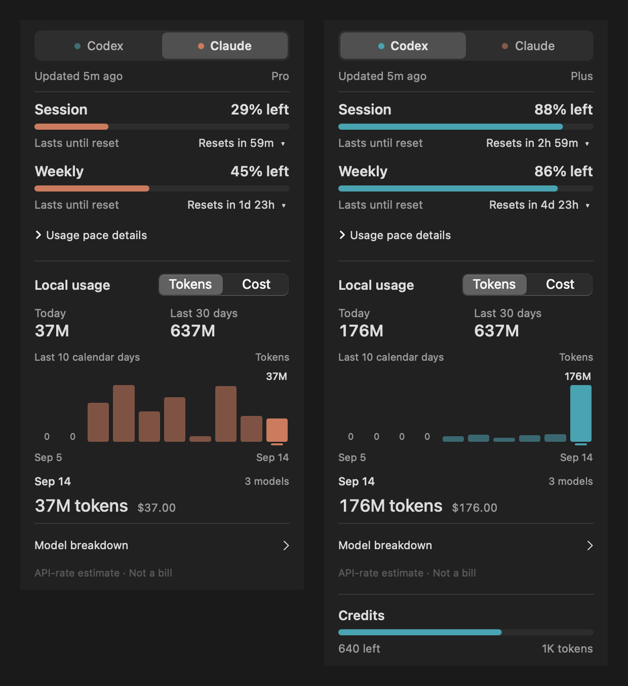
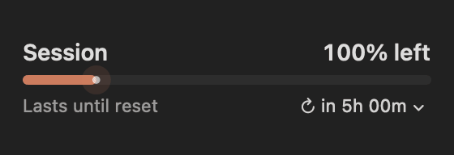
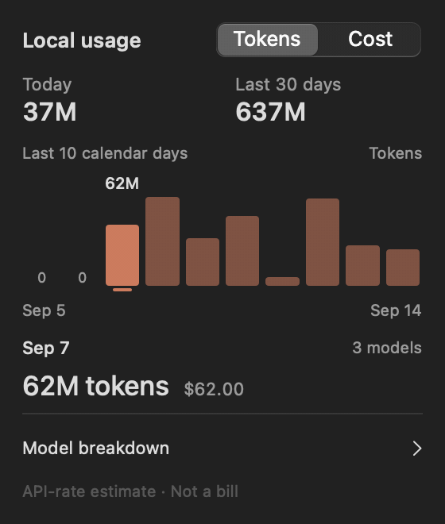
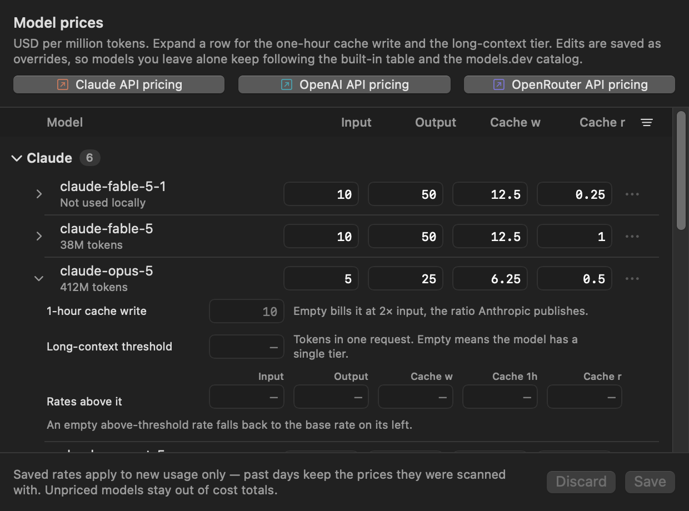

<p align="center">
  
</p>

<h1 align="center">QuotaBar</h1>

<p align="center">
  <a href="README.md"><kbd>English</kbd></a>
  <a href="README.zh-CN.md"><kbd>简体中文</kbd></a>
</p>

A macOS menu bar app for checking Codex and Claude quota, reset times, local token usage, and estimated cost.

<p align="center">
  
</p>

QuotaBar supports Codex and Claude in one menu bar item. It is a rebuild of [CodexBar](https://github.com/steipete/CodexBar).

## Features

- Shows remaining session and weekly quota, reset time, usage pace, and credits when available.
- Charts local Codex and Claude token use and estimated cost by day and model.
- Prices GPT-6 Astra Standard, Fast, and long-context usage, with editable Standard rates.
- Includes matching OpenCode and Pi Agent OpenAI OAuth usage under Codex.
- Switches providers from one menu bar icon and refreshes each provider independently.
- Uses built-in pricing, the public [models.dev](https://models.dev) catalog, and optional manual rate overrides.
- Keeps the last good quota reading when a refresh fails.
- Disables motion when macOS Reduce Motion is enabled.

<p align="center">
  
</p>

## Install

QuotaBar requires macOS 14 or later. The Homebrew cask and release ZIP currently support Apple Silicon only. Prebuilt releases do not require Xcode or Swift.

Quota tracking uses OAuth credentials created by Codex CLI, Claude Code, or both on the same Mac. API-key-only sessions are not supported.

### Homebrew

```bash
brew install --cask softmaxe/tap/quota-bar
```

Update or remove it with:

```bash
brew upgrade --cask quota-bar
brew uninstall --cask quota-bar
```

To remove the app and its saved data:

```bash
brew uninstall --zap --cask quota-bar
```

### Manual download

Download the `arm64` ZIP from [GitHub Releases](https://github.com/softmaxe/quota-bar/releases), unzip it, and move `QuotaBar.app` to `/Applications`.

Each ZIP has a matching `.sha256` file. Verify it before unzipping:

```bash
shasum -a 256 -c QuotaBar-*-macos-arm64.zip.sha256
```

Releases are ad hoc signed, not notarized with an Apple Developer ID. If macOS blocks the first launch, try opening the app once, then go to **System Settings → Privacy & Security** and choose **Open Anyway**. As a fallback, after confirming the app is in `/Applications`, remove quarantine from this app only:

```bash
xattr -dr com.apple.quarantine /Applications/QuotaBar.app
```

## First launch

QuotaBar reuses OAuth credentials created by the official CLIs. It has no separate login flow. Sign in through each CLI you want to track:

```bash
codex login
claude
```

Then open QuotaBar:

- Left-click the menu bar icon to view quota and local cost.
- Right-click it to switch between Codex and Claude.
- Open **Settings** to choose a refresh interval or edit model rates.

Reading Claude credentials may trigger a macOS Keychain prompt. If a manual `Refresh` receives HTTP 401, QuotaBar lets Claude Code attempt one short credential refresh. Automatic refreshes never start Claude Code.

## How quota tracking works

Each available quota window shows the percentage left and its reset time. Click a `Resets in …` label to switch between a countdown and a clock time.

QuotaBar compares consumption with time elapsed. After three comparable weekly windows, it uses your recorded history for the weekly pace instead. Samples are kept for 56 days.

Background refresh can be manual or every 1, 2, 5, 15, or 30 minutes. The default is 5 minutes. Each provider has a one-minute refresh cooldown to avoid repeated requests and HTTP 429 responses.

When a session or weekly window resets, the next open plays a short reset animation. The last reading and pending animation survive an app restart.

<p align="center">
  
</p>

## How cost tracking works

QuotaBar calculates token and cost totals from local session data. It does not use a billing API.

Hover a day in the chart to see its model breakdown. Click the highlighted day to switch the chart between tokens and cost.

<p align="center">
  
</p>

| Source | Local data |
| --- | --- |
| Codex | `$CODEX_HOME/sessions` and `$CODEX_HOME/archived_sessions`, or the same paths under `~/.codex` |
| Claude | `$CLAUDE_CONFIG_DIR/projects`, or `~/.claude/projects` and `~/.config/claude/projects` |
| OpenCode | `$OPENCODE_DATA_HOME/opencode.db`, `$XDG_DATA_HOME/opencode/opencode.db`, or `~/.local/share/opencode/opencode.db` |
| Pi Agent | `$PI_CODING_AGENT_SESSION_DIR`, `$PI_CODING_AGENT_DIR/sessions`, or `~/.pi/agent/sessions` |

OpenCode data is included only when its `openai` provider uses OAuth and its account ID matches the current Codex account. Other providers, API-key sessions, and account mismatches are ignored. OpenCode totals do not affect quota bars.

Pi Agent data follows the same rule. Only `openai-codex` assistant usage from a matching OAuth account is included. Pi Agent totals do not affect quota bars, and their cost is estimated from QuotaBar's model prices rather than treated as an OpenAI billing statement.

The first scan of a large history may take time. QuotaBar keeps a compact SQLite usage history with the day, model, harness, token counts, and estimated cost, plus identifiers and scan positions for deduplication. Codex and Claude resume from the last byte read, while OpenCode and Pi Agent deduplicate records by stable IDs. Deleting source sessions does not delete recorded usage, even after restarting QuotaBar. Standard Codex rollout UUIDs prevent archive moves and copies from counting twice. The chart still shows the last 30 days; older records remain stored. The pricing catalog is cached for 24 hours. Manual rate changes apply to new usage only, so past totals keep the prices used when they were scanned.

On first use, QuotaBar copies any existing cost database from `~/Library/Caches/QuotaBar/cost-usage/` to the persistent location below, including committed SQLite WAL data. The old cache remains intact. Only usage already scanned can survive source deletion; sessions deleted before QuotaBar scanned them cannot be recovered. Scanner upgrades preserve recorded history instead of rebuilding it from source logs.

Codex also caches the active model, service tier, and last token totals, so appending to a long session does not replay its earlier records. Astra uses its complete built-in rates when a catalog entry omits cache or long-context prices. Its built-in rates follow the [official Astra model pricing](https://developers.openai.com/api/docs/models/gpt-6-astra).

<p align="center">
  
</p>

Cost totals are estimates. Provider billing rules, cache accounting, and price changes can make them differ from an invoice.

## Privacy and network access

QuotaBar reads CLI credentials and parses local session records, but it does not write to CLI credential stores. It uses timestamps, model names, token counts, stable record IDs, and the account IDs needed to match OAuth sessions. Prompt, response, and reasoning fields are discarded rather than stored in QuotaBar's usage history or uploaded.

The app stores its own data here:

```text
~/Library/Application Support/QuotaBar/usage-history.json
~/Library/Application Support/QuotaBar/pricing-overrides.json
~/Library/Application Support/QuotaBar/cost-usage/cost-usage.sqlite
~/Library/Caches/QuotaBar/model-pricing/
~/Library/Preferences/com.quotabar.app.plist
```

Codex quota requests use the `chatgpt_base_url` in `$CODEX_HOME/config.toml`, if set, or the default ChatGPT endpoint. QuotaBar also contacts `auth.openai.com` to refresh Codex tokens, `api.anthropic.com` for Claude quota, and `models.dev` for model pricing. It does not send local session records to these services.

## Build and develop

Building requires the Swift 6 toolchain from Xcode or the Command Line Tools. The project uses Swift Package Manager and has no Xcode project.

```bash
git clone https://github.com/softmaxe/quota-bar.git
cd quota-bar
make app
open build/QuotaBar.app
```

Common commands:

```bash
make build          # Build the debug binary
make run            # Build and run in the foreground
make test           # Run assertions and animation verifiers
make probe          # Check both provider integrations
make probe-cost     # Rescan local logs; may refresh model prices
make benchmark-startup # Measure status-item construction offline in a debug build
make benchmark-cost # Measure Codex scans with offline pricing; reads local logs
make logs           # Stream logs for com.quotabar.app
make readme-assets  # Rebuild README images; requires ffmpeg
make clean
```

`make probe` prints account and usage metadata. Review its output before sharing it.

To create a test package, run **Build and Release** from the repository's **Actions** tab. To publish a release, push a tag matching `vMAJOR.MINOR.PATCH`. The workflow tests and packages an `arm64` ZIP, then creates the GitHub Release.

## Troubleshooting

| Problem | What to check |
| --- | --- |
| Provider is not signed in | Run that CLI's login flow, then choose `Refresh`. Use `make probe` for the raw error. |
| Data is stale or refresh returns HTTP 429 | Wait for the provider cooldown and select a longer refresh interval. |
| Cost totals are missing | Confirm the CLI writes session logs to the paths above. A model also needs a catalog price or manual rate. |
| OpenCode usage is missing | Confirm OpenCode uses `openai` OAuth with the same account as Codex. Check **Settings → Pricing** for database or authentication errors. |
| Pi Agent usage is missing | Confirm Pi Agent uses `/login openai-codex` with the same account as Codex. Check **Settings → Pricing** for session or authentication errors. |

## Limitations

- Prebuilt releases and the Homebrew cask support Apple Silicon only. Release ZIPs are ad hoc signed and not notarized.
- Claude credential recovery runs only after a manual `Refresh` and may still require opening Claude Code for interactive sign-in.
- Cost figures come from local logs and are not billing statements.
- OpenCode does not save the authentication method for each historical request. QuotaBar cannot reconstruct an OAuth to API key to OAuth switch that happened while it was not running.

## License

QuotaBar is licensed under [AGPL-3.0](LICENSE). Code adapted from CodexBar remains available under its MIT terms. See [THIRD_PARTY_NOTICES.md](THIRD_PARTY_NOTICES.md).

## Acknowledgements

QuotaBar uses ideas and implementation details from CodexBar, Copyright © 2026 Peter Steinberger.
